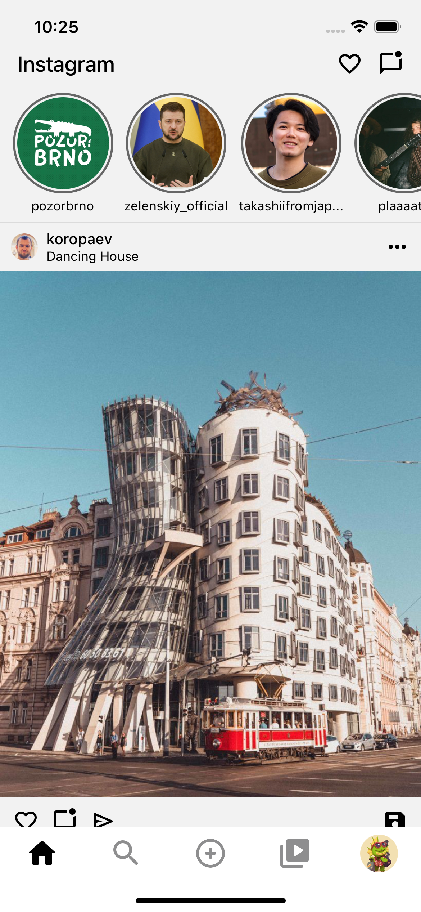

# Instagram UI clone



The project features:

- Home page with posts and stories
- Explore page with photos
- Reels page with videos and scrolling
- Profile page with stats
- A working like button

## Setup

If you want to play around with this project, feel free to clone it. To start, please enter the following commands

```GIT
git clone https://github.com/Earthsplit/react-native-instagram
cd react-native-instagram
npm install
npm run start
```
